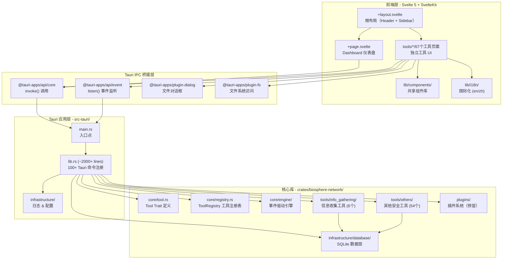
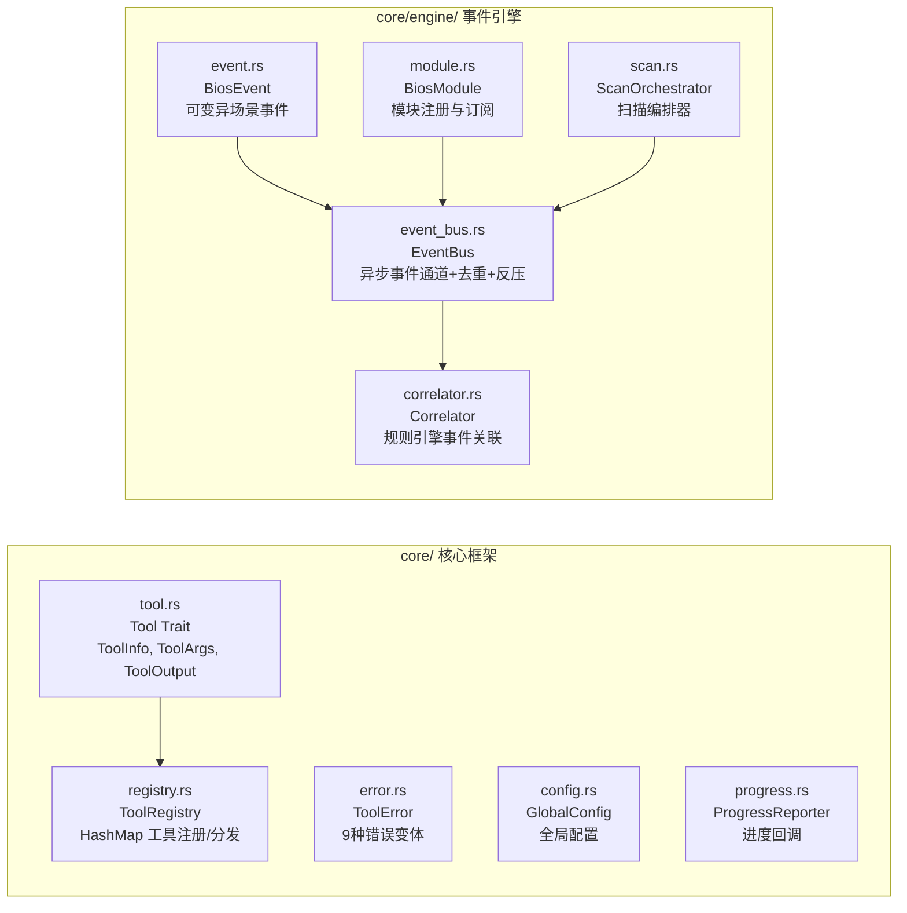
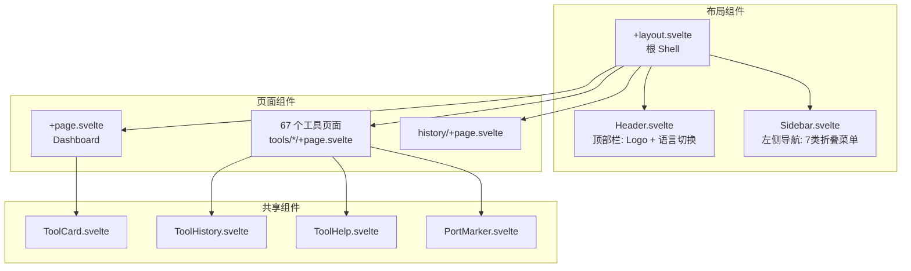
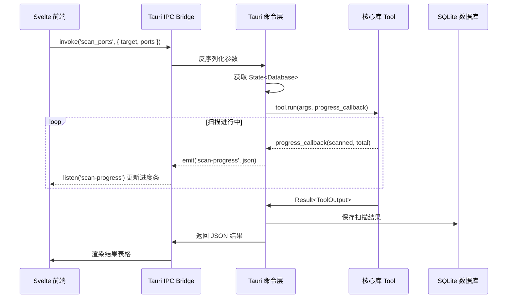
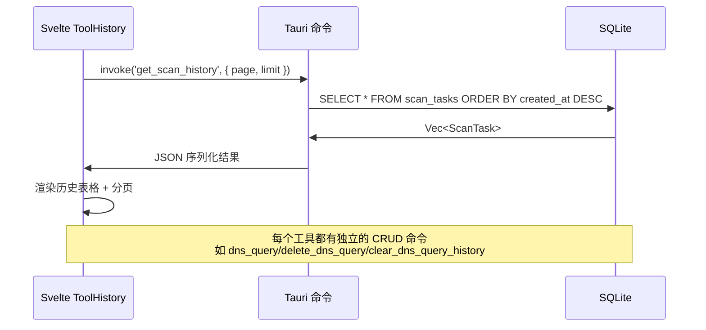
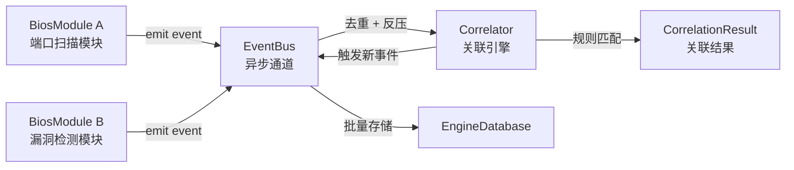
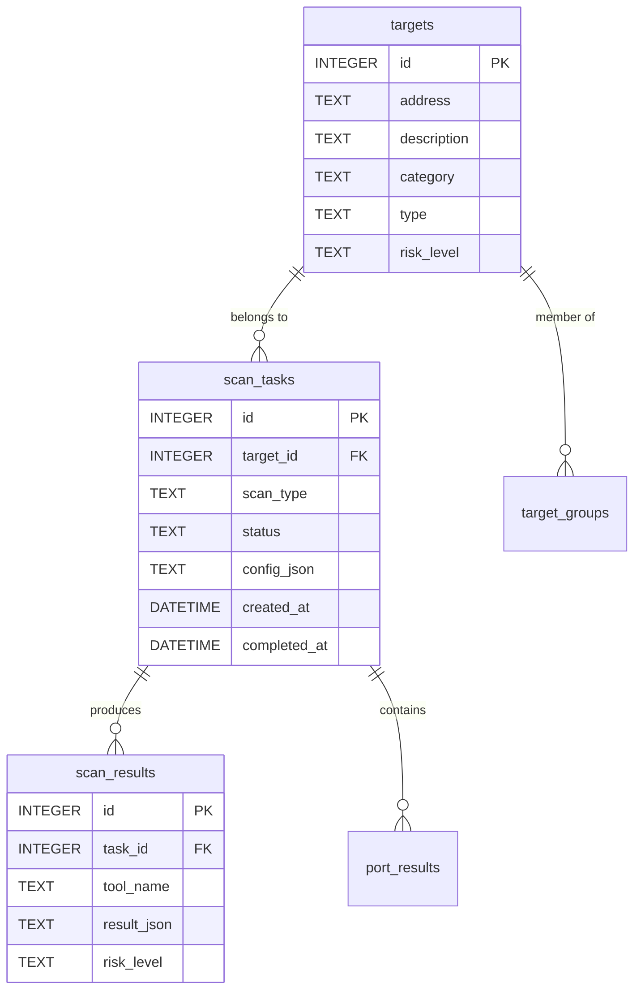

# Biosphere Network App — 系统架构设计文档

> 版本: 0.2.0 | 更新: 2026-05-21 | 作者: Biosphere Network Team

---

## 目录

1. [项目概览](#1-项目概览)
2. [整体架构图](#2-整体架构图)
3. [技术栈](#3-技术栈)
4. [Rust 后端架构](#4-rust-后端架构)
5. [Svelte 前端架构](#5-svelte-前端架构)
6. [核心数据流](#6-核心数据流)
7. [工具系统架构](#7-工具系统架构)
8. [数据库设计](#8-数据库设计)
9. [工具实现状态矩阵](#9-工具实现状态矩阵)
10. [已知问题与优化方向](#10-已知问题与优化方向)

---

## 1. 项目概览

Biosphere Network App 是一个基于 **Tauri v2** 构建的跨平台桌面网络安全工具集，提供 68+ 安全扫描与分析工具，涵盖信息收集、Web 扫描、漏洞检测、密码攻击、无线安全、取证分析等领域。

### 核心特性
- **跨平台**: macOS / Windows / Linux 原生桌面应用
- **工具丰富**: 68+ 安全工具，覆盖信息收集到后渗透全链条
- **事件驱动引擎**: 内置事件总线与关联分析引擎
- **SQLite 持久化**: 完整的历史记录与扫描结果存储
- **双语支持**: 中英文界面切换

---

## 2. 整体架构图



---

## 3. 技术栈

### 前端
| 技术 | 版本 | 用途 |
|------|------|------|
| Svelte | 5.x | UI 框架（含 runes 响应式） |
| SvelteKit | 2.9.x | 应用框架（路由、布局） |
| TypeScript | 5.6.x | 类型检查 |
| Tailwind CSS | 3.4.x | 工具类 CSS（部分使用） |
| Vite | 6.x | 构建工具 |
| adapter-static | 3.0.x | SPA 模式适配（Tauri 需要） |

### 后端
| 技术 | 版本 | 用途 |
|------|------|------|
| Rust | Edition 2021 | 核心语言 |
| Tauri | v2 | 桌面应用框架 |
| tokio | latest | 异步运行时 |
| rusqlite | bundled | SQLite 数据库 |
| reqwest | latest | HTTP 客户端 |
| serde / serde_json | latest | 序列化 |
| rayon | latest | 并行计算 |

### 构建系统
- **Cargo Workspace**: 2 个成员 crate（库 + 应用）
- **npm + Vite**: 前端构建
- **start.sh**: 统一开发启动脚本

---

## 4. Rust 后端架构

### 4.1 Cargo Workspace 结构

```
biosphere-network-app/          # Workspace Root (Cargo.toml)
├── crates/biosphere-network/   # 核心库 crate（纯 Rust，无 Tauri 依赖）
│   └── src/
│       ├── core/               # 基础框架层
│       ├── infrastructure/     # 基础设施层
│       ├── tools/              # 工具集合层
│       └── plugins/            # 插件系统（预留）
└── src-tauri/                  # Tauri 应用 crate
    └── src/
        ├── main.rs             # 入口点
        ├── lib.rs              # 应用核心（~2000+ 行）
        └── infrastructure/     # 日志 & 配置
```

### 4.2 核心层 (core/)



**Tool Trait 设计（策略模式）**:
```rust
pub trait Tool: Send + Sync {
    fn info(&self) -> ToolInfo;
    fn run(&self, args: ToolArgs, progress: Option<Box<dyn ProgressReporter>>) 
        -> Result<ToolOutput>;
}
```

**EventBus 特性**:
- SPSC 异步通道（tokio background task）
- 事件去重（HashSet）
- 溯源循环检测（防止无限事件链）
- 反压机制（阈值触发事件丢弃）
- 批量数据库存储
- 多轮空闲检测（优雅完成扫描）

### 4.3 Tauri 命令层 (src-tauri/src/lib.rs)

**架构模式**:
```rust
tauri::Builder::default()
    .setup(|app| {
        // 初始化 ToolRegistry, Database, Logger
        app.manage(Mutex::new(registry));
        app.manage(Mutex::new(db));
        Ok(())
    })
    .invoke_handler(tauri::generate_handler![
        // 100+ 命令平铺注册
        scan_ports,
        dns_query,
        // ...
    ])
    .run(...)
```

**关键设计模式**:
1. **State 注入**: `State<Mutex<Database>>` + `State<Mutex<ToolRegistry>>`
2. **事件发射**: `app_handle.emit("scan-progress", json)` 实时进度
3. **Action Router**: `target_manager(action: String, ...)` 单命令多操作
4. **错误转换**: 所有命令返回 `Result<T, String>`

### 4.4 工具系统 (tools/)

```
tools/
├── info_gathering/    # 6 个完全实现的工具
│   ├── port_scanner/  # 端口扫描（9个文件，最复杂）
│   ├── host_to_ip/    # 主机名解析
│   ├── dns_query/     # DNS 查询
│   ├── ping/          # Ping 探测
│   ├── target_manager/# 目标管理
│   └── whois/         # WHOIS 查询
│
├── others/            # 54 个工具（30 个完全实现 + 24 个类型定义）
│   ├── [30 tools with tool.rs]   # 完整实现
│   └── [24 stubs, config.rs only] # 仅类型定义
│
├── web_attack/        # 完全预留
├── password_attack/   # 完全预留
├── wireless_attack/   # 完全预留
├── forensics/         # 完全预留
└── post_exploitation/ # 完全预留
```

---

## 5. Svelte 前端架构

### 5.1 路由结构

```
src/routes/
├── +layout.svelte          # 根布局: Header + Sidebar + <slot/>
├── +layout.ts              # ssr = false (Tauri SPA 模式)
├── +page.svelte            # Dashboard 仪表盘
├── history/+page.svelte    # 扫描历史页
└── tools/                  # 67 个独立工具页面
    ├── port_scanner/+page.svelte
    ├── dns_query/+page.svelte
    ├── whois/+page.svelte
    └── ... (more tools)
```

### 5.2 组件层级



### 5.3 状态管理

**当前方案**: 无集中式状态管理
- 每个工具页面自行管理本地状态（`$state()` / `let`）
- 仅有一个全局 Svelte Store: `locale`（语言设置，持久化到 localStorage）
- 自定义 `EventBus` 类已定义但未使用

**Tauri 通信模式**:
```typescript
// 模式 A: 静态导入（复杂页面）
import { invoke } from '@tauri-apps/api/core';
const result = await invoke<ReturnType>('command_name', { params });

// 模式 B: 动态导入（可复用组件）
const { invoke } = await import('@tauri-apps/api/core');

// 事件监听
import { listen } from '@tauri-apps/api/event';
const unlisten = await listen<ProgressEvent>('scan-progress', (event) => {
    // UI 更新
});
```

### 5.4 样式方案

- **主导**: 组件级 `<style>` 块 + CSS 自定义属性（暗色主题）
- **辅助**: Tailwind CSS 工具类（仅 history 页使用）
- **配色**: 紫色主色调 (`#a855f7`) + 靛蓝辅助 (`#6366f1`) + 暗色背景 (`#0a0e17`)

---

## 6. 核心数据流

### 6.1 工具执行流程



### 6.2 历史记录流程



### 6.3 事件引擎数据流（未集成到 Tauri）



---

## 7. 工具系统架构

### 7.1 工具分类体系

| 类别 | 目录 | 工具数 | 实现状态 |
|------|------|--------|----------|
| **信息收集** | `info_gathering/` | 6 | ✅ 全部完成 |
| **Web 工具** | `others/` (部分) | ~15 | 🟡 混合 |
| **加密/编码** | `others/` (部分) | ~8 | ✅ 大部分完成 |
| **漏洞扫描** | `others/` (部分) | ~10 | 🟡 混合 |
| **高级工具** | `others/` (部分) | ~25 | 🔴 大部分仅类型定义 |
| **Web 攻击** | `web_attack/` | 0 | 🔴 完全预留 |
| **密码攻击** | `password_attack/` | 0 | 🔴 完全预留 |
| **无线攻击** | `wireless_attack/` | 0 | 🔴 完全预留 |
| **取证** | `forensics/` | 0 | 🔴 完全预留 |
| **后渗透** | `post_exploitation/` | 0 | 🔴 完全预留 |

### 7.2 工具实现模式

每个完全实现的工具遵循统一的文件结构：

```
tool_name/
├── mod.rs       # 模块声明 + 公共导出
├── config.rs    # 配置类型定义 (ToolNameConfig)
├── tool.rs      # Tool trait 实现 (ToolNameTool)
├── result.rs    # 结果类型定义（可选）
├── scanner.rs   # 核心扫描逻辑（可选）
└── resolver.rs  # 网络解析逻辑（可选）
```

**仅有类型定义的工具（Stub）**:
```
tool_name/
├── mod.rs       # pub mod config; pub use config::*;
└── config.rs    # 详细类型定义（500-1400行），但无 Tool trait 实现
```

---

## 8. 数据库设计

### 8.1 核心表结构



### 8.2 历史记录表（每个工具独立）

每个工具都有自己的历史记录表：

| 工具 | 历史表 | 管理命令 |
|------|--------|----------|
| DNS Query | `dns_queries` | `dns_query`, `delete_dns_query`, `clear_dns_query_history` |
| Ping | `ping_records` | `ping`, `delete_ping_record`, `clear_ping_history` |
| WHOIS | `whois_records` | `whois_query`, `delete_whois_record`, `clear_whois_history` |
| SSL Check | `ssl_checks` | `check_ssl_command`, `delete_ssl_check_record`, ... |
| Site Check | `site_checks` | 同上模式 |
| WAF Detect | `waf_detections` | 同上模式 |
| Port Scan | `scan_tasks` + `port_results` | 复合表结构 |
| ... | | |

---

## 9. 工具实现状态矩阵

### 9.1 完整实现 (36 个)

| # | 工具 | 目录 | tool.rs | Tauri 命令 | 前端页面 | 数据库 |
|---|------|------|---------|------------|----------|--------|
| 1 | Port Scanner | `info_gathering/port_scanner/` | ✅ | ✅ | ✅ | ✅ |
| 2 | Host to IP | `info_gathering/host_to_ip/` | ✅ | ✅ | ✅ | ✅ |
| 3 | DNS Query | `info_gathering/dns_query/` | ✅ | ✅ | ✅ | ✅ |
| 4 | Ping | `info_gathering/ping/` | ✅ | ✅ | ✅ | ✅ |
| 5 | Target Manager | `info_gathering/target_manager/` | ✅ | ✅ | ✅ | ✅ |
| 6 | WHOIS | `info_gathering/whois/` | ✅ | ✅ | ✅ | ✅ |
| 7 | Encoder/Decoder | `others/encoder_decoder/` | ✅ | ✅ | ✅ | ✅ |
| 8 | Password Generator | `others/password_generator/` | ✅ | ✅ | ✅ | ✅ |
| 9 | ZIP Extractor | `others/zip_extractor/` | ✅ | ✅ | ✅ | ✅ |
| 10 | Hash Identifier | `others/hash_identifier/` | ✅ | ✅ | ✅ | ✅ |
| 11 | SSL Checker | `others/ssl_checker/` | ✅ | ✅ | ✅ | ✅ |
| 12 | Site Checker | `others/site_checker/` | ✅ | ✅ | ✅ | ✅ |
| 13 | WAF Detector | `others/waf_detector/` | ✅ | ✅ | ✅ | ✅ |
| 14 | Wordlist Generator | `others/wordlist_generator/` | ✅ | ✅ | ✅ | ✅ |
| 15 | Subdomain Enum | `others/subdomain_enum/` | ✅ | ✅ | ✅ | ✅ |
| 16 | Dir Scanner | `others/dir_scanner/` | ✅ | ✅ | ✅ | ✅ |
| 17 | CVE Lookup | `others/cve_lookup/` | ✅ | ✅ | ✅ | ✅ |
| 18 | Email Verifier | `others/email_verifier/` | ✅ | ✅ | ✅ | ✅ |
| 19 | Username OSINT | `others/username_osint/` | ✅ | ✅ | ✅ | ✅ |
| 20 | IDN Checker | `others/idn_checker/` | ✅ | ✅ | ✅ | ✅ |
| 21 | Param Discovery | `others/param_discovery/` | ✅ | ✅ | ✅ | ✅ |
| 22 | Subdomain Takeover | `others/subdomain_takeover/` | ✅ | ✅ | ✅ | ✅ |
| 23 | Web Crawler | `others/web_crawler/` | ✅ | ✅ | ✅ | ✅ |
| 24 | Tech Detector | `others/tech_detector/` | ✅ | ✅ | ✅ | ✅ |
| 25 | Secret Scanner | `others/secret_scanner/` | ✅ | ✅ | ✅ | ✅ |
| 26 | SQLi Scanner | `others/sqli_scanner/` | ✅ | ✅ | ✅ | ✅ |
| 27 | XSS Scanner | `others/xss_scanner/` | ✅ | ✅ | ✅ | ✅ |
| 28 | Hash Cracker | `others/hash_cracker/` | ✅ | ✅ | ✅ | ✅ |
| 29 | Steganography | `others/steganography/` | ✅ | ✅ | ✅ | ✅ |
| 30 | CORS Checker | `others/cors_checker/` | ✅ | ✅ | ✅ | ✅ |
| 31 | Open Redirect | `others/open_redirect/` | ✅ | ✅ | ✅ | ✅ |
| 32 | Cookie Analyzer | `others/cookie_analyzer/` | ✅ | ✅ | ✅ | ✅ |
| 33 | Admin Finder | `others/admin_finder/` | ✅ | ✅ | ✅ | ✅ |
| 34 | Command Injection | `others/command_injection/` | ✅ | ✅ | ✅ | ✅ |
| 35 | Security Headers | `others/security_headers/` | ✅ | ✅ | ✅ | ✅ |
| 36 | Social Crawler | `others/social_crawler/` | ✅ | ✅ | ✅ | ✅ |

### 9.2 类型定义但无实现 (32 个)

这些工具在 `config.rs` 中定义了丰富的类型结构，在 `lib.rs` 中有公开导出，但 **缺少 `tool.rs`**（无 `Tool` trait 实现）。运行时调用会 panic 或返回错误。

| # | 工具 | config.rs 行数 | Tauri 命令 | 前端页面 | 风险 |
|---|------|---------------|------------|----------|------|
| 1 | Brute Force | 865 | ❌ | ✅ | 🔴 无实现 |
| 2 | Metadata Extractor | ? | ❌ | ✅ | 🔴 无实现 |
| 3 | Network Discovery | ? | ❌ | ✅ | 🔴 无实现 |
| 4 | WiFi Scanner | ? | ✅ | ✅ | 🔴 命令无实现 |
| 5 | Cloud Audit | 1374 | ✅ | ✅ | 🔴 命令无实现 |
| 6 | APK Analysis | ? | ✅ | ✅ | 🔴 命令无实现 |
| 7 | DNS Analyzer | ? | ✅ | ✅ | 🔴 命令无实现 |
| 8 | DDoS Tester | 898 | ✅ | ✅ | 🔴 命令无实现 |
| 9 | Privilege Esc Check | ? | ✅ | ✅ | 🔴 命令无实现 |
| 10 | Binary Analyzer | ? | ✅ | ✅ | 🔴 命令无实现 |
| 11 | Exploit Framework | 66797 | ✅ | ✅ | 🟡 有扫描逻辑但无 Tool trait |
| 12 | Post Exploitation | ? | ✅ | ✅ | 🔴 命令无实现 |
| 13 | Phishing Detector | ? | ✅ | ✅ | 🔴 命令无实现 |
| 14 | Payload Injector | ? | ✅ | ✅ | 🔴 命令无实现 |
| 15 | Anonymity Checker | ? | ✅ | ✅ | 🔴 命令无实现 |
| 16 | Forensics Analyzer | ? | ✅ | ✅ | 🔴 命令无实现 |
| 17 | AD Audit | ? | ✅ | ✅ | 🔴 命令无实现 |
| 18 | Mobile Security | ? | ✅ | ✅ | 🔴 命令无实现 |
| 19 | Asset Search | ? | ✅ | ✅ | 🔴 命令无实现 |
| 20 | Reverse IP | ? | ✅ | ✅ | 🔴 命令无实现 |
| 21 | CF Bypass | ? | ✅ | ✅ | 🔴 命令无实现 |
| 22 | Social Finder | ? | ✅ | ✅ | 🔴 命令无实现 |
| 23 | OSINT Gather | ? | ✅ | ✅ | 🔴 命令无实现 |
| 24 | Reverse Engineer | ? | ✅ | ✅ | 🔴 命令无实现 |
| 25 | WiFi Deauth Detector | ? | ✅ | ✅ | 🔴 命令无实现 |
| 26 | RAT Tool | ? | ✅ | ✅ | 🔴 命令无实现 |
| 27 | Bluetooth Scanner | ? | ✅ | ✅ | 🔴 命令无实现 |
| 28 | Memory Forensics | ? | ❌ | ✅ | 🔴 无实现 |
| 29 | Firmware Analyzer | ? | ❌ | ✅ | 🔴 无实现 |
| 30 | Social Engineering | ? | ✅ | ✅ | 🔴 命令无实现 |
| 31 | Payload Generator | ? | ❌ | ❌ | 🟡 仅类型 |
| 32 | SocialMedia Finder | ? | ❌ | ❌ | 🟡 仅类型 |

### 9.3 完全预留分类 (5 个)

| 类别 | 目录 | 状态 |
|------|------|------|
| Web 攻击 | `web_attack/` | `mod.rs` 内全部注释 |
| 密码攻击 | `password_attack/` | `mod.rs` 内全部注释 |
| 无线攻击 | `wireless_attack/` | `mod.rs` 内全部注释 |
| 取证 | `forensics/` | `mod.rs` 内全部注释 |
| 后渗透 | `post_exploitation/` | `mod.rs` 内全部注释 |

---

## 10. 已知问题与优化方向

### 🔴 严重问题
1. **32 个 stub 工具注册了 Tauri 命令** — 前端调用这些命令会 panic 或返回错误
2. **EventBus 引擎未集成** — `core/engine/` 模块已实现但 Tauri 层完全未使用
3. **Plugin 系统空实现** — 仅有一个注释掉的 `mod.rs`

### 🟡 中等问题
4. **前端无 Tauri 通信抽象层** — 67 个页面重复 `invoke()` 调用模式
5. **Svelte 4/5 混合** — 部分组件用 runes (`$state`)，部分仍用 `export let`
6. **样式方案不统一** — 仅 history 页用 Tailwind，其余用 scoped CSS
7. **无集中式状态管理** — 每页独立管理状态，无共享 Store
8. **Custom EventBus 未使用** — 前端 `lib/core/events.ts` 已定义但无引用
9. **工具页面高度重复** — 67 个页面遵循相同模式，可抽象为通用模板

### 🟢 优化建议
10. **实现 Tool trait 的 stub 工具** — 优先级排序，逐步补全 32 个工具
11. **集成 EventBus 引擎到 Tauri** — 将事件引擎暴露为 Tauri 命令和事件
12. **创建前端 service 层** — 封装 Tauri invoke 调用
13. **完成 Svelte 5 迁移** — 统一使用 runes 响应式
14. **统一样式方案** — 决定 Tailwind 或 scoped CSS 作为唯一方案
15. **工具页面模板化** — 抽取通用 ToolPage 布局和逻辑
16. **补齐测试覆盖** — 当前项目中未发现测试文件
17. **添加 CI/CD 流水线** — 自动化构建、测试、发布
18. **错误处理标准化** — 统一前端错误提示和重试机制

---

*本文档自动生成于 2026-05-21，基于代码静态分析。*
